

# Software Design & Architecture Project

**Domain-Driven Design & Microservices Report**

---

**Student:** Michiel Brand
**Student Number:** Q173978195964068764
**Date:** 26 October 2025

---

# System Expansion: EasyParkPlus Multi-Facility Architecture with DDD and Microservices

## Executive Summary

This document designs the expansion of EasyParkPlus from a single parking lot prototype to a scalable, multi-facility system with EV charging capabilities. Using Domain-Driven Design (DDD) and microservices architecture, we create a system that can support:

- **Multiple parking facilities** across different locations
- **Electric vehicle (EV) charging stations** at each facility
- **Independent scaling** of services based on demand
- **Clear domain boundaries** for different business areas
- **Fault isolation** through service separation
- **Technology flexibility** for each service

**Architecture Approach:** Domain-Driven Design with Microservices

---

## Part 1: Domain-Driven Design Analysis

### 1.1 Business Domain Overview

**EasyParkPlus Business:**
A parking management and EV charging service provider operating multiple parking facilities across cities.

**Core Business Capabilities:**
1. Allocate parking spaces to vehicles
2. Manage EV charging at charging stations
3. Track vehicle locations and charging sessions
4. Generate billing for services
5. Provide visibility to customers

**Strategic Importance:**
- Parking Management: **Core Domain** (competitive advantage)
- EV Charging: **Core Domain** (growing market)
- Vehicle Registry: **Supporting Subdomain** (supports core)
- Facility Management: **Supporting Subdomain** (operational)

---

### 1.2 Bounded Contexts

Bounded Contexts define boundaries within which domain models apply with consistent meaning.

#### **Context 1: Parking Management Bounded Context**

**Purpose:** Manage parking space allocation across facilities

**Responsibility:**
- Allocate parking spaces to vehicles
- Track space occupancy
- Support space searches (by color, make, model, registration)
- Handle space reservation and release
- Report lot status and availability

**Scope:** Everything related to parking spaces and their allocation

**Ubiquitous Language:**
- **Parking Space**: Designated slot within a parking lot
- **Space Type**: Regular or Electric-capable
- **Occupancy**: Whether space is occupied
- **Allocation**: Assignment of vehicle to space
- **Availability**: Space is empty and allocable
- **Lot Level**: Floor/section of parking lot
- **Capacity**: Total number of spaces in lot

**Model Concepts:**
- **Aggregate Root**: `ParkingLot`
- **Entities**: `ParkingSpace`, `Vehicle`
- **Value Objects**: `SpaceNumber`, `VehicleRegistration`, `Location`

---

#### **Context 2: EV Charging Bounded Context**

**Purpose:** Manage EV charging infrastructure and sessions

**Responsibility:**
- Register and manage charging stations
- Track charging sessions (start/stop)
- Monitor power distribution
- Track battery charge levels
- Manage charging schedules
- Report charging metrics

**Scope:** Everything related to EV charging operations

**Ubiquitous Language:**
- **Charging Station**: Physical charging equipment at facility
- **Connector Type**: Plug standard (Type 1, Type 2, CCS, etc.)
- **Charging Session**: Period when vehicle is charging
- **Charge Level**: Battery percentage (0-100%)
- **Power Output**: Charging speed (kW)
- **Charge Duration**: Time to charge from empty to full
- **Energy Consumed**: Total kWh during session

**Model Concepts:**
- **Aggregate Root**: `ChargingStation`
- **Entities**: `ChargingSession`, `Battery`
- **Value Objects**: `ChargeLevel`, `PowerOutput`, `Duration`

---

#### **Context 3: Vehicle Registry Bounded Context**

**Purpose:** Maintain vehicle information and ownership

**Responsibility:**
- Register vehicles
- Track vehicle information (make, model, color, registration)
- Identify vehicle type (car, motorcycle, truck, bus, EV)
- Support vehicle lookups

**Scope:** Vehicle master data

**Ubiquitous Language:**
- **Vehicle**: Identifiable transportation unit
- **Registration Number**: Unique identifier (license plate)
- **Make**: Manufacturer
- **Model**: Model name
- **Vehicle Type**: Category (Car, Truck, Motorcycle, Bus)
- **Power Type**: Fuel source (Gasoline, Diesel, Electric)

**Model Concepts:**
- **Aggregate Root**: `Vehicle`
- **Entities**: N/A
- **Value Objects**: `RegistrationNumber`, `VehicleSpec`, `PowerType`

---

#### **Context 4: Facility Management Bounded Context**

**Purpose:** Manage multiple parking facility locations

**Responsibility:**
- Register new parking facilities
- Track facility metadata (location, address, capacity)
- Manage facility features (EV charging available, etc.)
- Report facility usage and statistics

**Scope:** Facility master data and metadata

**Ubiquitous Language:**
- **Facility**: Single parking location/complex
- **Location**: Geographic position
- **Operating Hours**: When facility is active
- **Feature**: Capability (EV charging, security cameras, etc.)
- **Capacity**: Maximum vehicles

**Model Concepts:**
- **Aggregate Root**: `ParkingFacility`
- **Entities**: N/A
- **Value Objects**: `Address`, `Coordinates`, `OperatingHours`

---

#### **Context 5: Billing/Payments Bounded Context (Future)**

**Purpose:** Handle charges for parking and charging services

**Responsibility:**
- Calculate parking fees
- Calculate charging fees
- Generate invoices
- Process payments
- Track transactions

**Scope:** Monetary transactions

**Ubiquitous Language:**
- **Parking Fee**: Cost per hour/day
- **Charging Fee**: Cost per kWh
- **Session**: Parking or charging period for billing
- **Invoice**: Bill for services rendered
- **Payment**: Money transferred

**Model Concepts:**
- **Aggregate Root**: `Bill` / `Invoice`
- **Entities**: `LineItem`, `Payment`
- **Value Objects**: `Money`, `Price`, `Duration`

---

### 1.3 Context Relationships and Communication

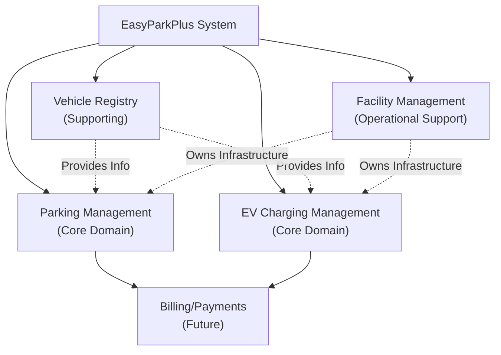

**Inter-Context Communication:**

| From | To | Message | Trigger |
|------|-----|---------|---------|
| Parking | Vehicle Registry | Validate registration | Vehicle parks |
| EV Charging | Vehicle Registry | Get vehicle info | Charging starts |
| Parking | Facility | Report occupancy | Space allocated |
| EV Charging | Facility | Report station usage | Session starts |
| Billing | Parking | Get parking session | End of parking |
| Billing | EV Charging | Get charging session | End of charging |

---

### 1.4 Domain Models

#### **Parking Management Domain Model**

**Aggregate Root: ParkingLot**
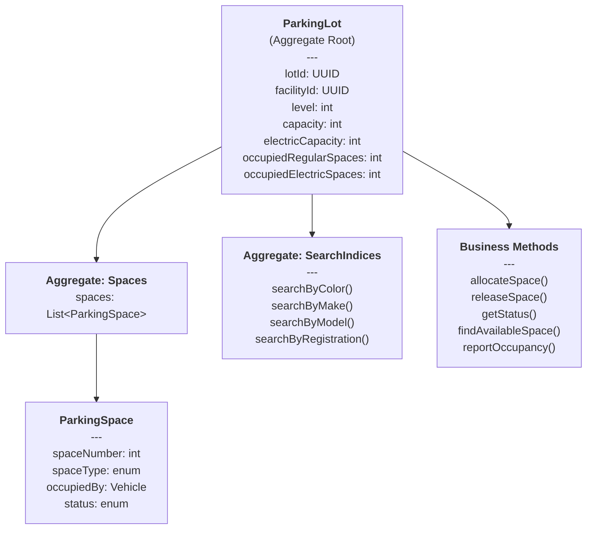

**Value Objects:**
- `SpaceNumber`: 1-based space identifier
- `VehicleType`: Car, Truck, Motorcycle, Bus, ElectricCar, ElectricBike
- `Location`: (latitude, longitude, address)
- `LotStatus`: { totalSpaces, occupiedSpaces, availableSpaces }

**Entities:**
- `ParkingSpace`: Represents individual space
- `Vehicle`: Represents parked vehicle

---

#### **EV Charging Domain Model**

**Aggregate Root: ChargingStation**
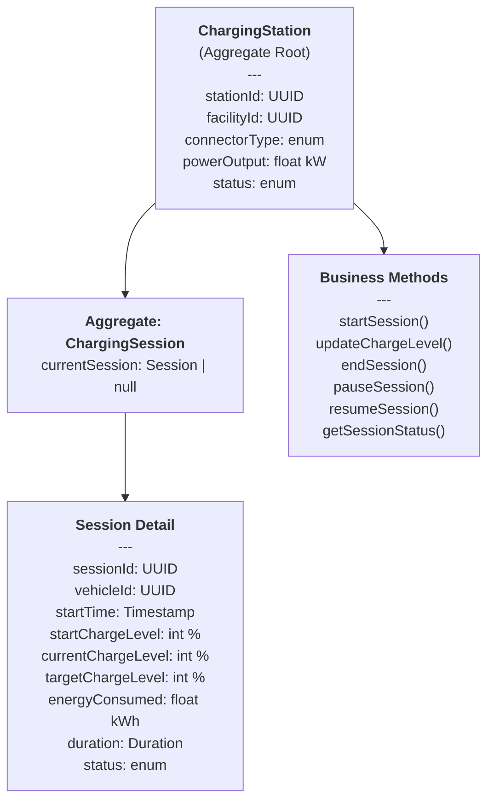

**Value Objects:**
- `ChargeLevel`: 0-100 percentage
- `PowerOutput`: kW (kilowatts)
- `EnergyConsumed`: kWh (kilowatt-hours)
- `Duration`: Time period
- `ChargingReceipt`: { energyConsumed, duration, cost }

**Entities:**
- `ChargingSession`: Represents charging event
- `ChargingHistory`: Historical charging records

---

#### **Vehicle Registry Domain Model**

**Aggregate Root: Vehicle**
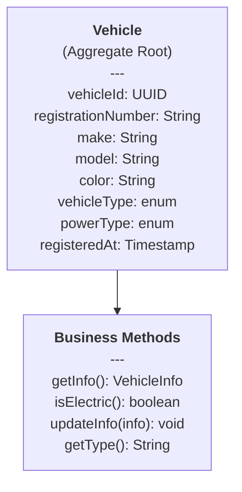

**Value Objects:**
- `RegistrationNumber`: String with format validation
- `VehicleSpec`: { make, model, color }
- `PowerType`: Enum for energy source

**Entities:**
- None (Vehicle is simple aggregate root)

---

#### **Facility Management Domain Model**

**Aggregate Root: ParkingFacility**
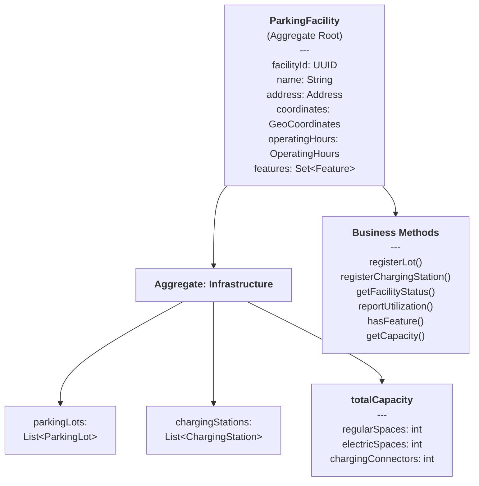

**Value Objects:**
- `Address`: { street, city, state, zip, country }
- `GeoCoordinates`: { latitude, longitude }
- `OperatingHours`: { openTime, closeTime, daysOpen }
- `Feature`: Enum (EV_CHARGING, SECURITY, CAMERAS, etc.)
- `FacilityStatus`: Summary of facility state

**Entities:**
- None (Facility is simple aggregate root)

---

## Part 2: Microservices Architecture

### 2.1 Service Decomposition

Based on bounded contexts, we decompose into microservices:

#### **Service 1: Parking Service**

**Responsibility:** Manage parking spaces and allocations

**API Endpoints:**

| Method | Endpoint | Purpose | Body/Params | Response |
|--------|----------|---------|------------|----------|
| POST | `/api/v1/parking-lots` | Create parking lot | `{ facilityId, level, capacity, electricCapacity }` | `{ lotId, status }` |
| POST | `/api/v1/parking-lots/{lotId}/allocate` | Park a vehicle | `{ vehicleId, registrationNumber, spaceType }` | `{ spaceNumber, lotId, allocationTime }` |
| DELETE | `/api/v1/parking-lots/{lotId}/spaces/{spaceNumber}` | Remove vehicle | `{ vehicleId }` | `{ spaceNumber, status }` |
| GET | `/api/v1/parking-lots/{lotId}/status` | Get occupancy status | - | `{ totalSpaces, occupiedSpaces, availableSpaces, occupancy% }` |
| GET | `/api/v1/parking-lots/{lotId}/search` | Search vehicles | `?color=Blue&make=Toyota` | `{ spaces: [...] }` |
| GET | `/api/v1/parking-lots/{lotId}/vehicles` | List parked vehicles | - | `{ vehicles: [...] }` |

**Database Schema:**

| Table | Column | Type | Constraints |
|-------|--------|------|-------------|
| **parking_lots** | lot_id | UUID | PK |
| | facility_id | UUID | FK to Facility Service |
| | level | int | - |
| | capacity | int | - |
| | electric_capacity | int | - |
| | created_at | timestamp | - |
| **parking_spaces** | space_id | UUID | PK |
| | lot_id | UUID | FK |
| | space_number | int | - |
| | space_type | enum | Regular/Electric |
| | occupied_by | UUID | vehicle_id |
| | status | enum | Empty/Occupied/Reserved |
| | allocated_at | timestamp | - |
| **vehicle_allocations** | allocation_id | UUID | PK |
| | lot_id | UUID | FK |
| | space_number | int | - |
| | vehicle_id | UUID | - |
| | action | enum | Allocate/Release |
| | timestamp | timestamp | - |

**Technology Stack:**
- Language: Python/Java/Go
- Framework: FastAPI/Spring Boot/Gin
- Database: PostgreSQL (parking state)
- Cache: Redis (quick lookups)
- Message Queue: RabbitMQ (allocation events)

---

#### **Service 2: EV Charging Service**

**Responsibility:** Manage EV charging stations and sessions

**API Endpoints:**

| Method | Endpoint | Purpose | Body/Params | Response |
|--------|----------|---------|------------|----------|
| POST | `/api/v1/charging-stations` | Register station | `{ facilityId, connectorType, powerOutput }` | `{ stationId, status }` |
| POST | `/api/v1/charging-sessions` | Start charging | `{ stationId, vehicleId, targetChargeLevel }` | `{ sessionId, startTime, estimatedDuration }` |
| PUT | `/api/v1/charging-sessions/{sessionId}` | Update charge level | `{ currentChargeLevel, energyConsumed, duration }` | `{ sessionId, chargeLevel, remainingTime }` |
| DELETE | `/api/v1/charging-sessions/{sessionId}` | End session | - | `{ sessionId, chargeLevel, energyConsumed, duration }` |
| GET | `/api/v1/charging-stations/{stationId}/status` | Get station status | - | `{ stationId, status, currentSession, powerOutput }` |
| GET | `/api/v1/charging-sessions` | List active sessions | - | `{ sessions: [...] }` |
| GET | `/api/v1/charging-sessions/{sessionId}/history` | Get history | - | `{ sessions: [...] }` |

**Database Schema:**
| Table | Column | Type | Constraints |
|-------|--------|------|-------------|
| **charging_stations** | station_id | UUID | PK |
| | facility_id | UUID | FK to Facility Service |
| | connector_type | enum | Type1/Type2/CCS/CHAdeMO |
| | power_output | float | kW |
| | status | enum | Available/Charging/Maintenance/Offline |
| | created_at | timestamp | - |
| **charging_sessions** | session_id | UUID | PK |
| | station_id | UUID | FK |
| | vehicle_id | UUID | - |
| | start_time | timestamp | - |
| | end_time | timestamp | - |
| | start_charge | int | % |
| | end_charge | int | % |
| | energy_consumed | float | kWh |
| | status | enum | Active/Complete/Paused |
| **charging_history** | history_id | UUID | PK |
| | vehicle_id | UUID | - |
| | session_data | JSON | - |
| | timestamp | timestamp | - |

**Technology Stack:**
- Language: Python/Java/Go
- Framework: FastAPI/Spring Boot/Gin
- Database: PostgreSQL (charging state)
- Time-Series DB: InfluxDB (charge level tracking)
- Message Queue: RabbitMQ (session events)

---

#### **Service 3: Vehicle Registry Service**

**Responsibility:** Maintain vehicle information

**API Endpoints:**

| Method | Endpoint | Purpose | Body/Params | Response |
|--------|----------|---------|------------|----------|
| POST | `/api/v1/vehicles` | Register vehicle | `{ registrationNumber, make, model, color, type, powerType }` | `{ vehicleId, registrationNumber }` |
| GET | `/api/v1/vehicles/{vehicleId}` | Get vehicle info | - | `{ vehicleId, registrationNumber, make, model, color, type, powerType }` |
| GET | `/api/v1/vehicles?registration={regNum}` | Search by registration | - | `{ vehicleId, ... }` |
| PUT | `/api/v1/vehicles/{vehicleId}` | Update vehicle | `{ color, make, model, ... }` | `{ vehicleId, ... }` |
| DELETE | `/api/v1/vehicles/{vehicleId}` | Remove vehicle | - | `{ status: deleted }` |

**Database Schema:**

| Table | Column | Type | Constraints |
|-------|--------|------|-------------|
| **vehicles** | vehicle_id | UUID | PK |
| | registration_number | String | Unique |
| | make | String | - |
| | model | String | - |
| | color | String | - |
| | vehicle_type | enum | Car/Truck/Motorcycle/Bus |
| | power_type | enum | Gasoline/Diesel/Electric/Hybrid |
| | is_active | boolean | - |
| | created_at | timestamp | - |
| | updated_at | timestamp | - |

**Technology Stack:**
- Language: Python/Java
- Framework: FastAPI/Spring Boot
- Database: PostgreSQL (vehicle master data)
- Cache: Redis (registration lookups)

---

#### **Service 4: Facility Management Service**

**Responsibility:** Manage parking facilities

**API Endpoints:**

| Method | Endpoint | Purpose | Body/Params | Response |
|--------|----------|---------|------------|----------|
| POST | `/api/v1/facilities` | Register facility | `{ name, address, coordinates, operatingHours, features }` | `{ facilityId, status }` |
| GET | `/api/v1/facilities` | List all facilities | - | `{ facilities: [...] }` |
| GET | `/api/v1/facilities/{facilityId}` | Get facility details | - | `{ facilityId, name, address, coordinates, lots, stations, features }` |
| GET | `/api/v1/facilities/{facilityId}/status` | Get utilization | - | `{ facilityId, totalCapacity, occupied, utilization%, chargingActive }` |
| PUT | `/api/v1/facilities/{facilityId}` | Update facility | `{ name, operatingHours, features, ... }` | `{ facilityId, ... }` |

**Database Schema:**

| Table | Column | Type | Constraints |
|-------|--------|------|-------------|
| **facilities** | facility_id | UUID | PK |
| | name | String | - |
| | street_address | String | - |
| | city | String | - |
| | state | String | - |
| | zip | String | - |
| | latitude | float | - |
| | longitude | float | - |
| | open_time | time | - |
| | close_time | time | - |
| | features | JSON array | - |
| | is_active | boolean | - |
| | created_at | timestamp | - |
| **facility_assets** | asset_id | UUID | PK |
| | facility_id | UUID | FK |
| | asset_type | enum | ParkingLot/ChargingStation |
| | asset_reference_id | UUID | lotId or stationId |
| | added_at | timestamp | - |

**Technology Stack:**
- Language: Python/Java
- Framework: FastAPI/Spring Boot
- Database: PostgreSQL (facility master data)
- Cache: Redis (facility lookups)

---

### 2.2 Microservices Architecture Diagram

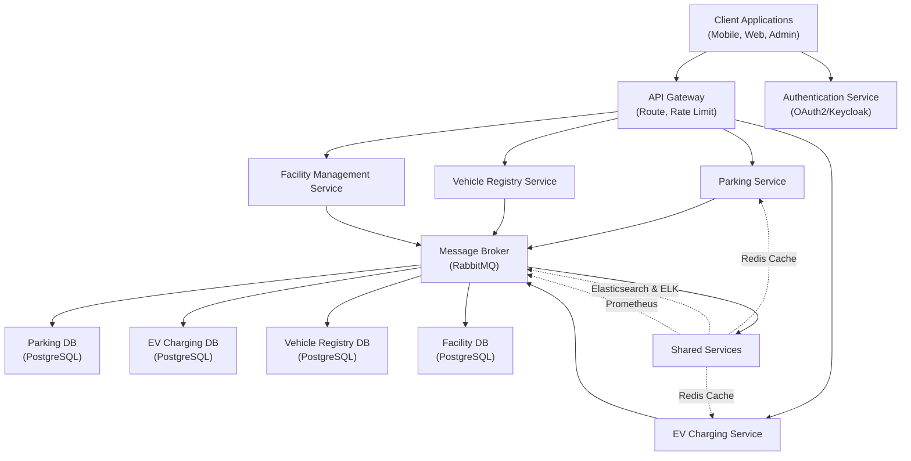

---

### 2.3 Inter-Service Communication Patterns

#### **Synchronous (Request-Response):**

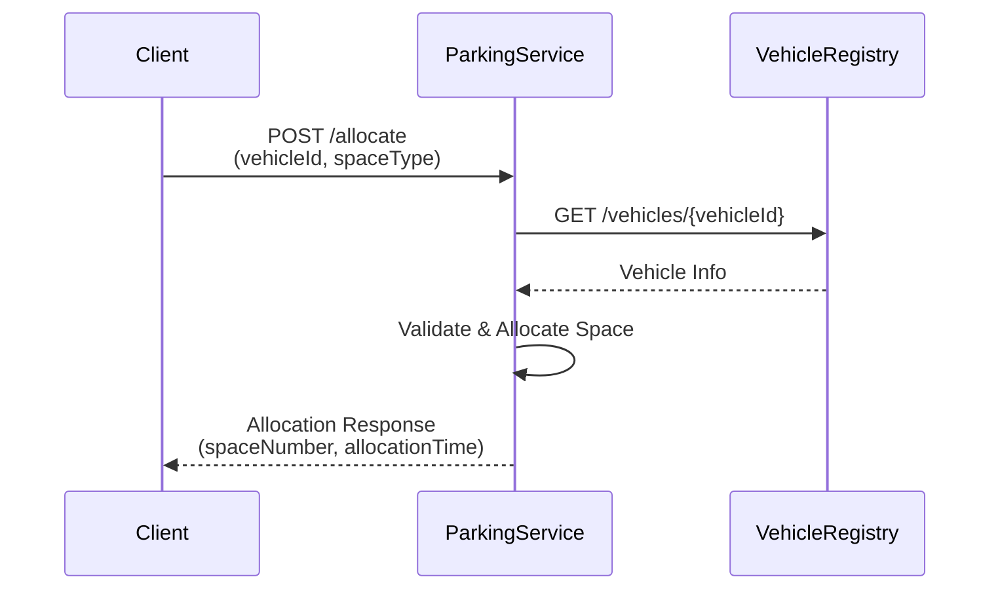

**Use Cases:**
- Validate vehicle before parking
- Check facility capacity
- Real-time status queries

---

#### **Asynchronous (Event-Driven):**

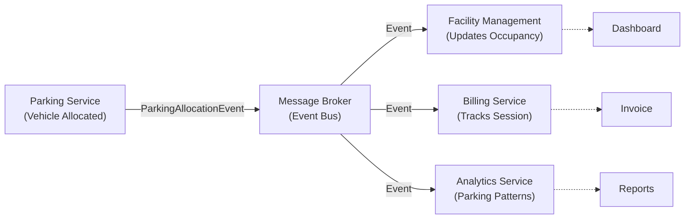

**Use Cases:**
- Publish parking events for analytics
- Trigger billing events
- Update facility dashboard
- Send notifications

---

### 2.4 Data Flow Examples

#### **Use Case: Park a Vehicle (EV)**

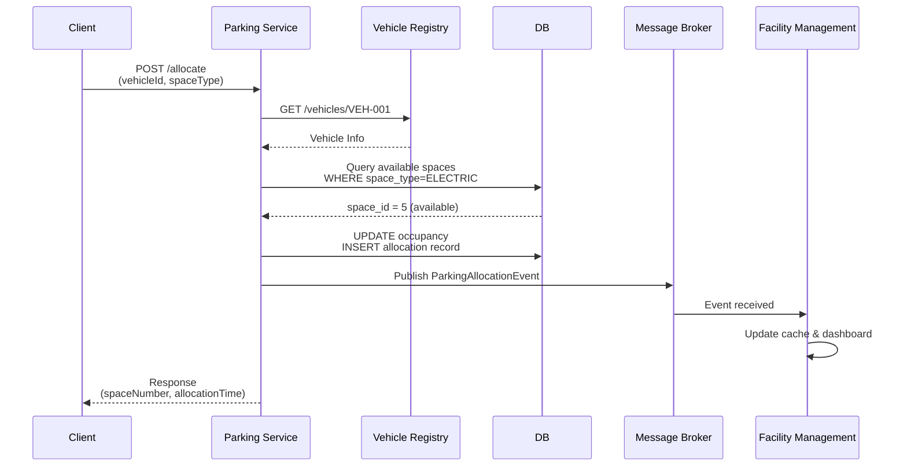

**Data Flow:**
1. Client sends allocation request for electric space
2. Parking Service validates vehicle via Vehicle Registry
3. Queries local DB for available electric parking space
4. Allocates space and records in DB
5. Publishes event to Message Broker
6. Facility Management updates occupancy cache
7. Returns allocated space details to client

---

#### **Use Case: Start EV Charging Session**

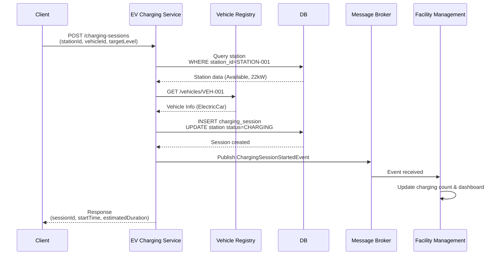

**Data Flow:**
1. Client initiates charging session for electric vehicle at station
2. EV Charging Service queries station availability and specifications
3. Validates vehicle via Vehicle Registry
4. Creates session record and updates station status to CHARGING
5. Publishes event to Message Broker
6. Facility Management updates active charging count
7. Returns session details with estimated charging duration

---

## Part 3: Deployment and Operations

### 3.1 Technology Stack Per Service

| Service | Backend | Framework | Database | Cache | Queue |
|---------|---------|-----------|----------|-------|-------|
| Parking | Python | FastAPI | PostgreSQL | Redis | RabbitMQ |
| EV Charging | Java | Spring Boot | PostgreSQL | Redis | RabbitMQ |
| Vehicle Registry | Python | FastAPI | PostgreSQL | Redis | - |
| Facility Mgmt | Go | Gin | PostgreSQL | Redis | - |

### 3.2 Deployment Architecture

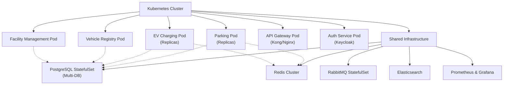

### 3.3 Scalability Considerations

**Horizontal Scaling:**
- Each service scales independently based on demand
- Parking Service: Scale with number of allocations/searches
- EV Charging: Scale with active charging sessions
- Vehicle Registry: Scale with lookup requests

**Database Scaling:**
- Read replicas for high-query services
- Write master for consistency
- Event sourcing for audit trail

**Caching Strategy:**
- Redis for frequently accessed data
- Cache-aside pattern
- TTL-based invalidation

---

## Part 4: Future Enhancements

### 4.1 Additional Bounded Contexts

**Billing/Payments Service:**
- Calculate charges based on parking duration and charging energy
- Process payments
- Generate invoices

**Reservation Service:**
- Allow advance parking space reservations
- Charging station reservations
- Cancellation handling

**Notification Service:**
- Send alerts when charging complete
- Send reminders for expiring reservations
- Send receipts and bills

**Analytics Service:**
- Track parking patterns
- Predict capacity needs
- Generate business intelligence reports

### 4.2 Advanced Features

**Mobile App Integration:**
- Real-time availability
- Mobile payment
- Charging notifications
- Reservation management

**Smart Features:**
- Dynamic pricing based on demand
- AI-based capacity prediction
- Autonomous vehicle support
- Integration with car infotainment systems

---

## Conclusion

This Domain-Driven Design and microservices architecture enables EasyParkPlus to:

1. **Scale horizontally**: Add new facilities and services without redesigning
2. **Develop independently**: Teams work on separate services
3. **Deploy independently**: Services deploy without coordinating
4. **Handle complexity**: Clear bounded contexts manage domain complexity
5. **Adapt to change**: New requirements integrate as new services
6. **Ensure reliability**: Fault isolation through service boundaries

The architecture is ready for growth from prototype to enterprise-scale system supporting multiple facilities and EV charging infrastructure across multiple cities.
