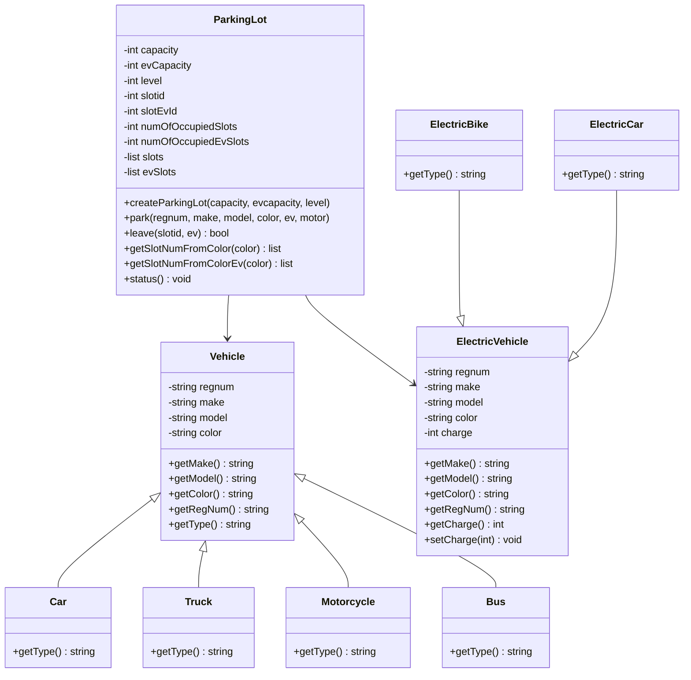
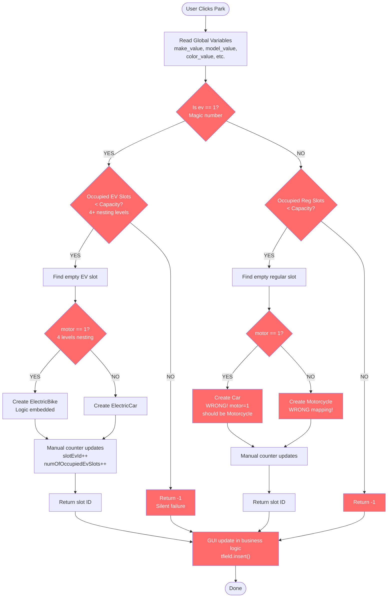
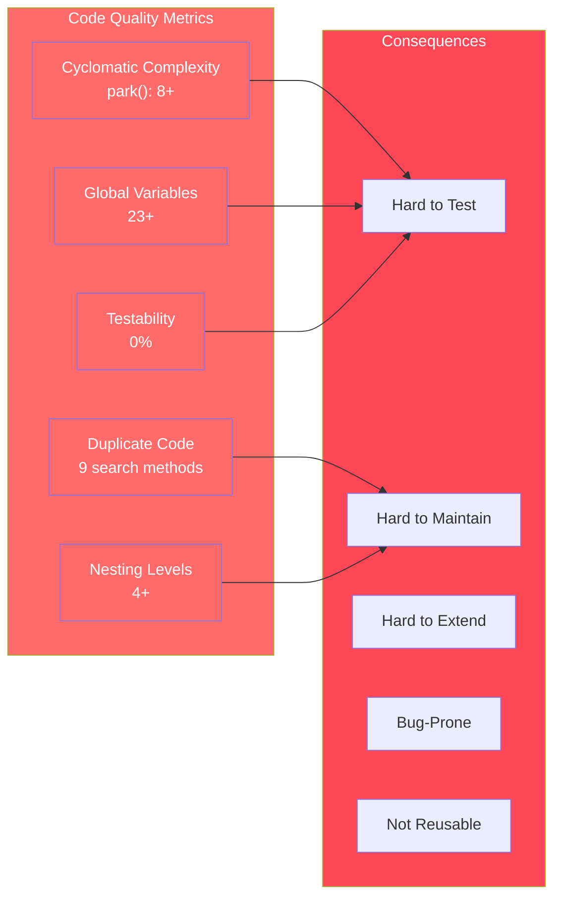
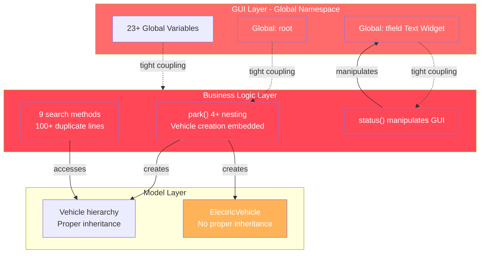

![Quantic Logo](data:image/svg+xml;base64,PHN2ZyB3aWR0aD0iMjJweCIgaGVpZ2h0PSIyNXB4IiB2aWV3Qm94PSIwIDAgMjIgMjUiIHZlcnNpb249IjEuMSIgeG1sbnM9Imh0dHA6Ly93d3cudzMub3JnLzIwMDAvc3ZnIiB4bWxuczp4bGluaz0iaHR0cDovL3d3dy53My5vcmcvMTk5OS94bGluayI+CiAgICA8ZyBpZD0iUGFnZS0xIiBzdHJva2U9Im5vbmUiIHN0cm9rZS13aWR0aD0iMSIgZmlsbD0ibm9uZSIgZmlsbC1ydWxlPSJldmVub2RkIj4KICAgICAgICA8ZyBpZD0iTXVsdGlwbGUtUHJvZ3JhbXMtKEdyYWR1YXRlZC1mcm9tLWFjdGl2ZSktLS1PdGhlcnMtdG8tQXBwbHktVG8iIHRyYW5zZm9ybT0idHJhbnNsYXRlKC03NzAuMDAwMDAwLCAtMTI5LjAwMDAwMCkiIGZpbGw9IiNGRjRENjMiPgogICAgICAgICAgICA8ZyBpZD0iRHJvcGRvd24iIHRyYW5zZm9ybT0idHJhbnNsYXRlKDc1NS4wMDAwMDAsIDYyLjAwMDAwMCkiPgogICAgICAgICAgICAgICAgPGcgaWQ9IkFjdGl2ZS1Qcm9ncmFtIiB0cmFuc2Zvcm09InRyYW5zbGF0ZSgwLjAwMDAwMCwgNTEuMDAwMDAwKSI+CiAgICAgICAgICAgICAgICAgICAgPHBhdGggZD0iTTI1LjkyMjczOTUsMTYgTDM2Ljg0NTQ3OTEsMjIuMjQ5OTM0NSBMMzYuODQ1NDc5MSwyOC40OTU5MzY1IEwzMS4zODE1OTY0LDMxLjYyMjIxNDUgTDMxLjM4MTU5NjQsMjUuMzc2NzM2OCBMMjUuOTIyNzM5NSwyMi4yNTMwODA0IEwyMC40NjQxNDcyLDI1LjM3NjczNjggTDIwLjQ2NDE0NzIsMzEuNjIzNzg3NSBMMjUuODEsMzQuNjgyIEwyNS44MTA4MTc1LDI4LjQ5NDIzNjMgTDM2LjYxODkzODcsMzQuNzQyODM1NCBMMzYuNjE4OTM4Nyw0MC45OTQ4NDIyIEwyNS45MjIsMzQuODExIEwyNS45MjI0NzUsNDEgTDE1LDM0Ljc1MDMyNzcgTDE1LDIyLjI0OTkzNDUgTDI1LjkyMjczOTUsMTYgWiIgaWQ9IkNvbWJpbmVkLVNoYXBlIj48L3BhdGg+CiAgICAgICAgICAgICAgICA8L2c+CiAgICAgICAgICAgIDwvZz4KICAgICAgICA8L2c+CiAgICA8L2c+Cjwvc3ZnPg==)

# Software Design & Architecture Project

**Original Design - UML Diagrams**

---

**Student:** Michiel Brand
**Student Number:** Q173978195964068764
**Date:** 26 October 2025

---

# Original Design - UML Diagrams

This document contains UML diagrams representing the original parking lot manager architecture before refactoring.

---

## Structural UML Diagram (Class Diagram) - Original Design

---

## Issues Summary

| Code Smell | Impact |
|-----------|--------|
| **Tight GUI-Business Coupling** | Cannot test business logic without GUI |
| **Global Variables (23+)** | Hard to track state, not thread-safe |
| **9 Duplicate Search Methods** | 100+ lines of copy-paste code |
| **Complex Nested Conditionals** | 4+ nesting levels, hard to understand |
| **Boolean Magic Numbers** | `ev=1`, `motor=1` unclear intent |
| **Magic Number -1** | Silent failures for errors |
| **Inconsistent Inheritance** | ElectricCar/Bike don't properly inherit |
| **Poor Variable Naming** | `slotid`, `regnum`, `numOfOccupiedSlots` cryptic |
| **No Error Handling** | Silent failures, no exceptions |

---

## Activity Diagram - park() Method (Original)

---

## Complexity Metrics - Original Design

---

## Dependency and Coupling Issues

---

## Key Problems Summary

### High Severity Issues

1. **Tight Coupling**: GUI and business logic intertwined
   - Cannot test business logic independently
   - Cannot reuse logic in different UI

2. **Global State**: 23+ global variables
   - Difficult to track dependencies
   - Not thread-safe
   - Makes code fragile

3. **Duplicate Code**: 9 search methods with identical logic
   - 100+ lines of copy-paste code
   - Maintenance nightmare
   - Bugs need fixing in multiple places

4. **Complex Logic**: park() method has 4+ nesting levels
   - Hard to understand
   - Hard to maintain
   - Difficult to test

### Medium Severity Issues

5. **Boolean Magic Numbers**: `ev=1`, `motor=1`
   - Unclear intent
   - Error-prone
   - Self-documenting code impossible

6. **Silent Failures**: Magic number `-1` for errors
   - No indication of failure reason
   - Hard to debug
   - Poor error handling

7. **Inconsistent Inheritance**: ElectricCar/Bike don't inherit
   - Type checking broken
   - Polymorphism not working
   - Code smell: improper OOP

8. **Poor Naming**: `slotid`, `regnum`, `numOfOccupiedSlots`
   - Reduces readability
   - Faster code rot
   - Hard onboarding

9. **No Exception Handling**
   - Silent failures
   - Unprofessional error handling
   - Poor user experience

---

## Conclusion

The original design shows classic anti-patterns that make the codebase:

- **Monolithic** - Everything in one file
- **Tightly Coupled** - GUI and logic inseparable
- **Untestable** - Cannot test without GUI
- **Duplicated** - Copy-paste code everywhere
- **Complex** - Deep nesting and cryptic logic
- **Not Reusable** - Business logic tied to GUI
- **Hard to Maintain** - Changes needed in multiple places

These issues prompted the need for comprehensive refactoring using design patterns and best practices.
