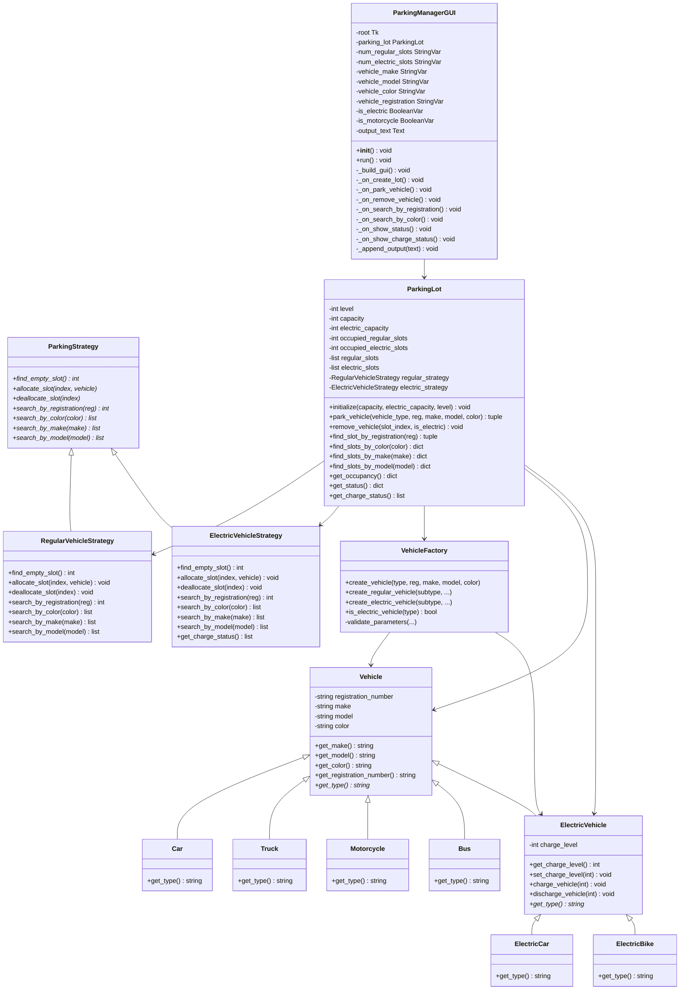
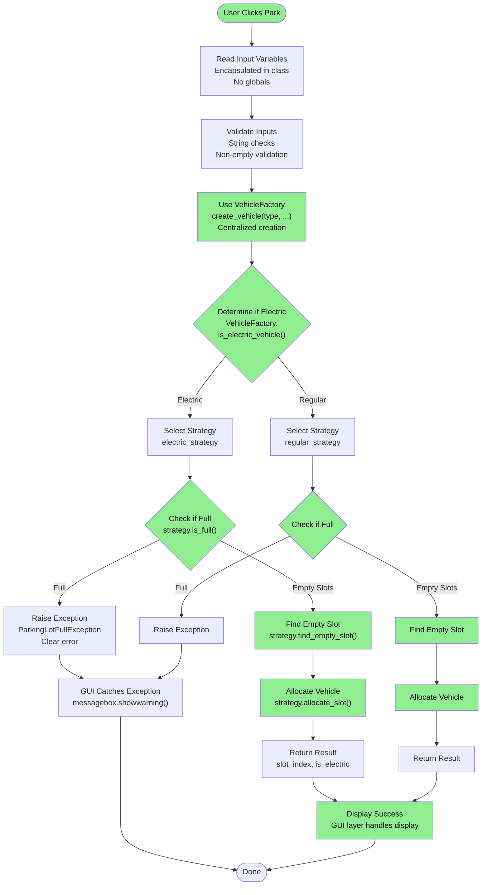
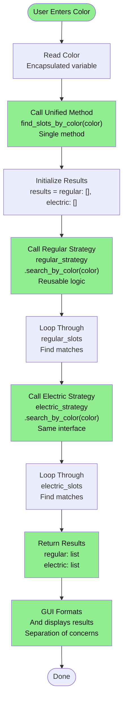
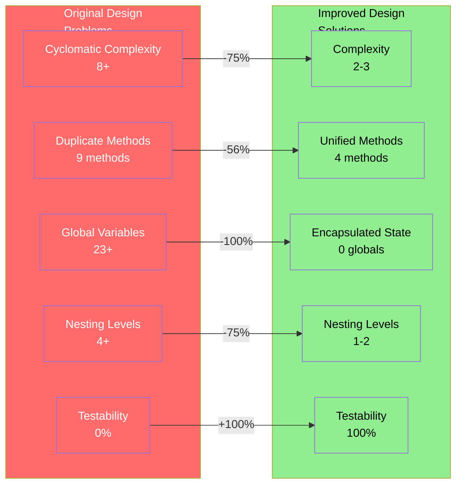
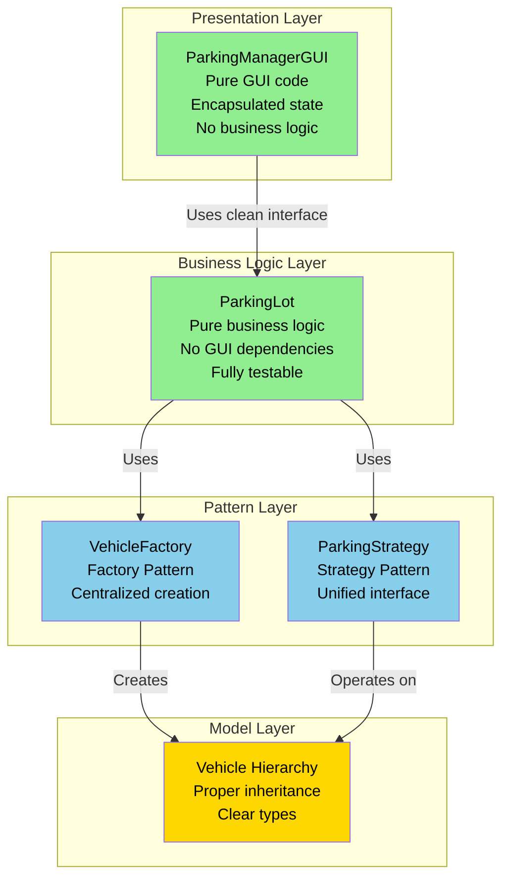
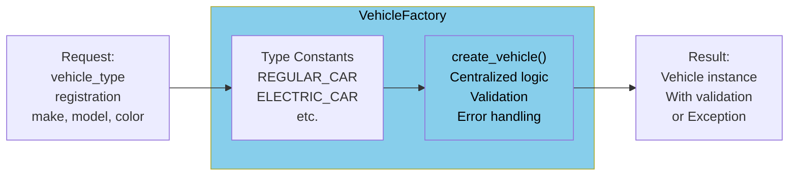
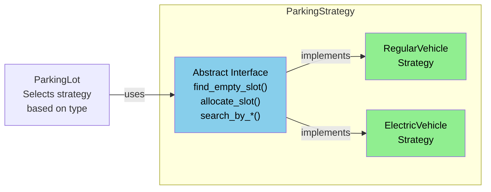

# Software Design & Architecture Project

**Redesigned Architecture - UML Diagrams**

---

**Student:** Michiel Brand
**Student Number:** Q173978195964068764
**Date:** 26 October 2025

---

# Redesigned Architecture - UML Diagrams

This document contains UML diagrams representing the refactored parking lot manager architecture after applying design patterns and best practices.

---

## Structural UML Diagram (Class Diagram) - Improved Design

---

## Behavioral Diagram - park_vehicle() Method (Improved)

---

## Behavioral Diagram - search_by_color() Method (Improved)

---

## Code Quality Improvements

---

## Architecture Layers (Improved)

---

## Design Patterns Applied

### Factory Pattern

### Strategy Pattern

---

## Improvements Summary Table

| Aspect | Before | After | Improvement |
|--------|--------|-------|-------------|
| **Cyclomatic Complexity** | 8+ | 2-3 | 75% reduction |
| **Duplicate Code** | 9 methods, 100+ lines | 0 methods | 100% elimination |
| **Global Variables** | 23+ | 0 | 100% eliminated |
| **Nesting Levels** | 4+ | 1-2 | 75% reduction |
| **Classes** | 1 monolithic | 7 focused | Better SRP |
| **Testability** | 0% (GUI coupled) | 100% (separated) | Complete |
| **Error Handling** | Silent (-1) | Exceptions | Professional |
| **Code Organization** | 1 file | 6 modules | Better structure |

---

## Extensibility Comparison

### Adding New Vehicle Type

**Before (Original):**
1. Add class to Vehicle.py
2. Modify nested conditionals in park()
3. Add counterparts to all 9 search methods
4. Update GUI logic
(Changes in multiple places)

**After (Improved):**
1. Add class to Vehicle.py
2. Add constant to VehicleFactory
3. Add condition to create_vehicle()
4. Done! (Everything else works)

---

## Conclusion

The refactored design achieves:

### **Maintainability**
- Clear separation of concerns
- Single Responsibility Principle
- DRY principle applied

### **Testability**
- Business logic independent from GUI
- No global dependencies
- Custom exceptions
- Input validation

### **Extensibility**
- Factory Pattern for new vehicle types
- Strategy Pattern for new behaviors
- Open-Closed Principle
- Clear extension points

### **Code Quality**
- Professional architecture
- Proper design patterns
- SOLID principles applied
- Comprehensive documentation

**Result:** Transformed from prototype to enterprise-ready software.
